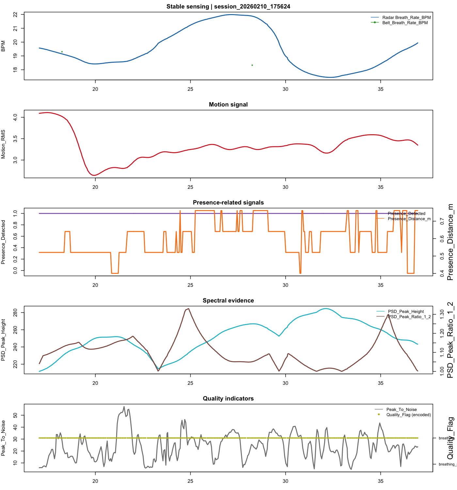
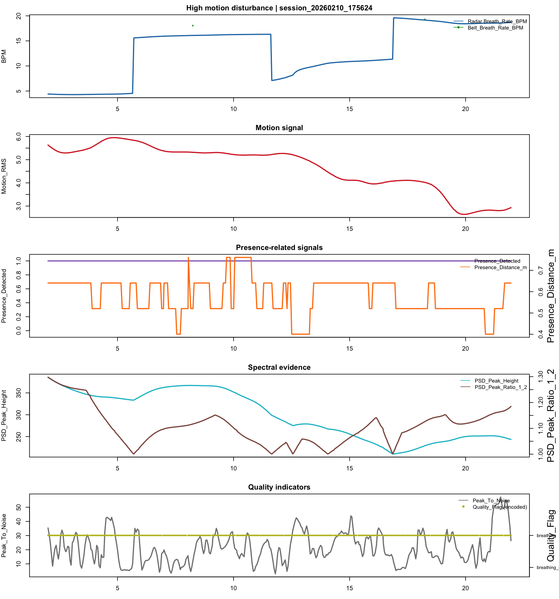
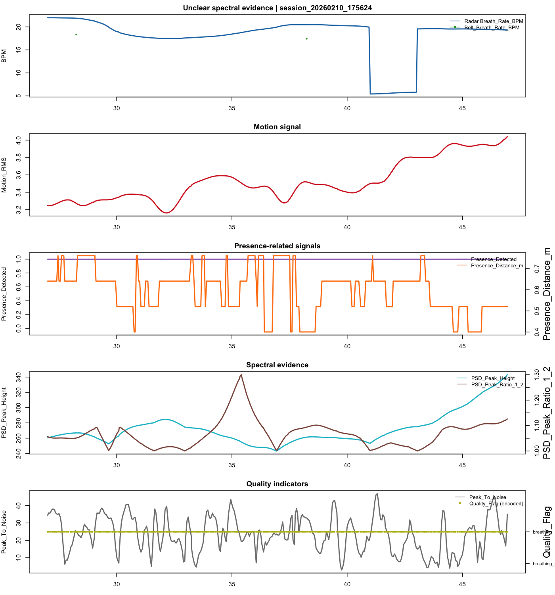
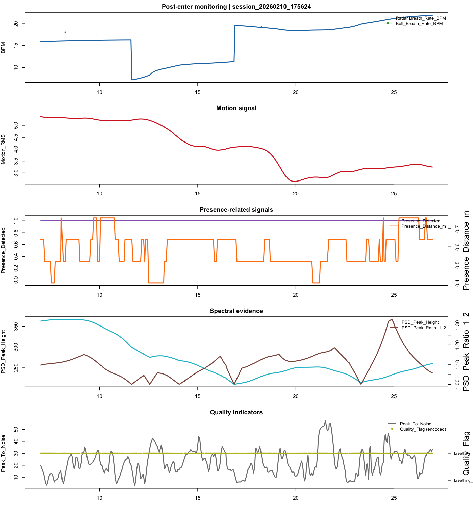
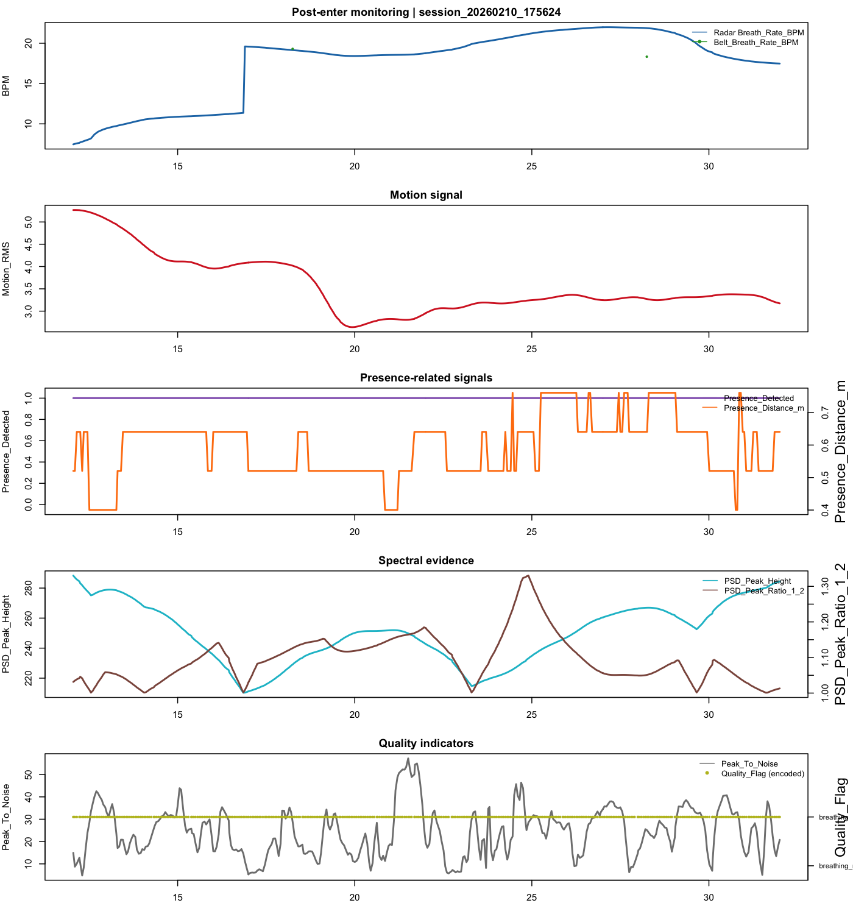

# Exploratory Radar Behavior Examples

This report surfaces contrasting **read-only** examples from existing sessions to illustrate how radar-derived signals evolve over short windows (20 seconds each).

## Signals shown in each plot
- `Breath_Rate_BPM` (with `Belt_Breath_Rate_BPM` overlaid when available)
- `Motion_RMS`
- Presence-related: `Presence_Detected` and `Presence_Distance_m`
- Spectral clarity: `PSD_Peak_Height` and `PSD_Peak_Ratio_1_2`
- Quality indicators: `Peak_To_Noise` and `Quality_Flag`
- X-axis in figures: `Time since human enter (s)` when `human_enter_time.txt` exists, else Unix time
- Window selection scope: only windows with `start_since_human_enter_s > 0`

## Example 1: Stable sensing

- Session: `session_20260210_175624`
- Radar file: `session_20260210_175624/20260210_175624_radar.csv`
- Window (Unix): `1770767854` to `1770767873`
- Human enter (Unix): `1770767837`
- Window (since human enter): `17.0 s` to `36.0 s`
- Window (UTC): `2026-02-10 23:57:34 UTC` to `2026-02-10 23:57:53 UTC`
- Summary metrics: motion_mean=3.334, presence_mean=1.000, psd_ratio_mean=1.105, peak_to_noise_mean=23.848, breathing_fraction=1.000

Interpretation:
- What radar seems to be seeing: Consistent periodic breathing with persistent presence lock.
- Why this may be reliable/unreliable: Likely reliable because motion is low while spectral peak strength and dominance stay elevated.
- Real-time system suggestion: Keep current posture and continue monitoring.

## Example 2: High motion disturbance

- Session: `session_20260210_175624`
- Radar file: `session_20260210_175624/20260210_175624_radar.csv`
- Window (Unix): `1770767839` to `1770767858`
- Human enter (Unix): `1770767837`
- Window (since human enter): `2.0 s` to `21.0 s`
- Window (UTC): `2026-02-10 23:57:19 UTC` to `2026-02-10 23:57:38 UTC`
- Summary metrics: motion_mean=4.737, presence_mean=1.000, psd_ratio_mean=1.109, peak_to_noise_mean=21.178, breathing_fraction=1.000

Interpretation:
- What radar seems to be seeing: Strong body or environmental movement overlapping the respiratory micro-motion.
- Why this may be reliable/unreliable: Likely unreliable because motion proxy rises and breathing evidence becomes more volatile.
- Real-time system suggestion: Hold still for 10-20 seconds before trusting the rate estimate.

## Example 3: Unclear spectral evidence

- Session: `session_20260210_175624`
- Radar file: `session_20260210_175624/20260210_175624_radar.csv`
- Window (Unix): `1770767864` to `1770767883`
- Human enter (Unix): `1770767837`
- Window (since human enter): `27.0 s` to `46.0 s`
- Window (UTC): `2026-02-10 23:57:44 UTC` to `2026-02-10 23:58:03 UTC`
- Summary metrics: motion_mean=3.506, presence_mean=1.000, psd_ratio_mean=1.067, peak_to_noise_mean=23.388, breathing_fraction=1.000

Interpretation:
- What radar seems to be seeing: Presence is detected but spectral peaks are not sharply dominant.
- Why this may be reliable/unreliable: Potentially unreliable because the breathing spectrum appears ambiguous despite target presence.
- Real-time system suggestion: Ask the user to hold steady and verify after additional accumulation.

## Example 4: Post-enter monitoring

- Session: `session_20260210_175624`
- Radar file: `session_20260210_175624/20260210_175624_radar.csv`
- Window (Unix): `1770767844` to `1770767863`
- Human enter (Unix): `1770767837`
- Window (since human enter): `7.0 s` to `26.0 s`
- Window (UTC): `2026-02-10 23:57:24 UTC` to `2026-02-10 23:57:43 UTC`
- Summary metrics: motion_mean=4.115, presence_mean=1.000, psd_ratio_mean=1.105, peak_to_noise_mean=21.956, breathing_fraction=1.000

Interpretation:
- What radar seems to be seeing: Typical post-entry tracking segment with ongoing presence.
- Why this may be reliable/unreliable: Moderate reliability; use this as context and confirm with neighboring windows.
- Real-time system suggestion: Continue monitoring and trigger prompts only if quality trends downward.

## Example 5: Post-enter monitoring

- Session: `session_20260210_175624`
- Radar file: `session_20260210_175624/20260210_175624_radar.csv`
- Window (Unix): `1770767849` to `1770767868`
- Human enter (Unix): `1770767837`
- Window (since human enter): `12.0 s` to `31.0 s`
- Window (UTC): `2026-02-10 23:57:29 UTC` to `2026-02-10 23:57:48 UTC`
- Summary metrics: motion_mean=3.620, presence_mean=1.000, psd_ratio_mean=1.094, peak_to_noise_mean=24.103, breathing_fraction=1.000

Interpretation:
- What radar seems to be seeing: Typical post-entry tracking segment with ongoing presence.
- Why this may be reliable/unreliable: Moderate reliability; use this as context and confirm with neighboring windows.
- Real-time system suggestion: Continue monitoring and trigger prompts only if quality trends downward.

## Notes
- No model training was performed.
- Existing datasets were only read, not modified or relabeled.

